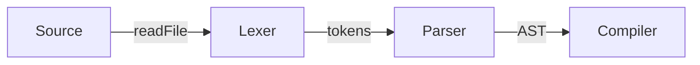

# Quetzal Language Compiler - Lexer and Parser Documentation

## Lexer (`Lexer.h`/`Lexer.cpp`)

### Overview
The lexer performs lexical analysis by converting source code into tokens. It handles:
- Keywords and identifiers
- Literals (integers, strings, booleans)
- Operators and separators
- Comments (line and block)
- Special character detection

### Key Features
```cpp
class Lexer {
    std::string source;
    size_t position, line, column;
    std::vector<Token> tokens;

    // Core methods
    Token tokenize();
    static std::string tokenKindToString(TokenKind kind);
};
```

## Token Types

| TokenKind      | Example      | Description                    |
|---------------|-------------|--------------------------------|
| IDENTIFIER    | variable    | Variable/function names       |
| LIT_INT       | 42          | Integer literals              |
| LIT_STR       | "hello"     | String literals               |
| LIT_BOOL      | true        | Boolean literals              |
| LINE_COMMENT  | // comment  | Single-line comments          |
| BLOCK_COMMENT | /* comment */ | Multi-line comments        |
| UNKNOWN       | ñ, 😊 | Special/unsupported characters |

## Special Character Handling

Non-ASCII characters (like ñ or emojis) are explicitly marked as UNKNOWN tokens:

```cpp
bool isSpecialChar(char c) {
    return static_cast<unsigned char>(c) > 127;
}
```

## Parser (`Parser.h`/`Parser.cpp`)

### Overview

A deterministic top-down (LL(1)) recursive descent parser that:

- Validates token streams against grammar rules
- Builds implicit syntax trees through function calls
- Provides detailed error reporting

### Grammar Rules

```ebnf
program     → declaration* EOF
declaration → varDecl | statement
statement  → printStmt | block | ifStmt | loopStmt | exprStmt
expression → assignment
assignment → IDENTIFIER "=" assignment | logical_or
logical_or → logical_and ("or" logical_and)*
```

### Parsing Technique

| Characteristic  | Implementation         |
|---------------|----------------------|
| Type         | Recursive-descent    |
| Lookahead    | 1 token (LL(1))      |
| Direction    | Top-down             |
| Error Handling | Exception-based   |

### Example Parse Flow

```cpp
// 1. Start parsing
void Parser::parse() {
    program();  // Entry point
}

// 2. Handle declarations
void Parser::program() {
    while (!isAtEnd()) {
        declaration();
    }
}

// 3. Dispatch to specific rules
void Parser::declaration() {
    if (match({TokenKind::VAR})) {
        varDeclaration();
    } else {
        statement();
    }
}
```

## Error Handling

### Lexer Errors

| Error Case          | Exception Message               |
|--------------------|--------------------------------|
| Unclosed string    | Unterminated string literal    |
| Invalid character  | Unknown character: ñ          |
| Unclosed block comment | Unterminated block comment |

### Parser Errors

| Error Case         | Example Message                |
|--------------------|--------------------------------|
| Missing semicolon  | Expected ';' after expression |
| Invalid assignment | Invalid assignment target     |
| Missing parenthesis | Expected ')' after condition |

## Integration

### Compilation Pipeline



### Main Workflow (`main.cpp`)

```cpp
int main() {
    string source = readFile("program.qtz");
    Lexer lexer(source);
    auto tokens = lexer.tokenize();

    Parser parser(tokens);
    parser.parse();

    return 0;
}
```

## Building and Testing

### Build Requirements

- C++17 compatible compiler
- CMake 3.10+
- (Optional) Google Test for unit tests

### Test Cases

```bash
# Valid program
echo 'var x = 42;' > test.qtz
./compiler test.qtz

# Program with special characters
echo 'print("ñ");' > special.qtz
./compiler special.qtz  # Will flag 'ñ' as UNKNOWN
```

## Limitations

- No full Unicode support (only ASCII + special character detection)
- Basic error recovery (fails on first error)
- No AST generation yet (validation-only)

## Extension Points

### Add AST Generation:

- Modify parser functions to return AST nodes
- Implement `AST.h` with node classes

### Better Error Recovery:

```cpp
void Parser::synchronize() {
    while (!isAtEnd()) {
        if (previous().kind == SEMICOLON) return;
        switch (peek().kind) {
            case CLASS: case FUN: case VAR:
            case FOR: case IF: case WHILE:
                return;
        }
        advance();
    }
}
```